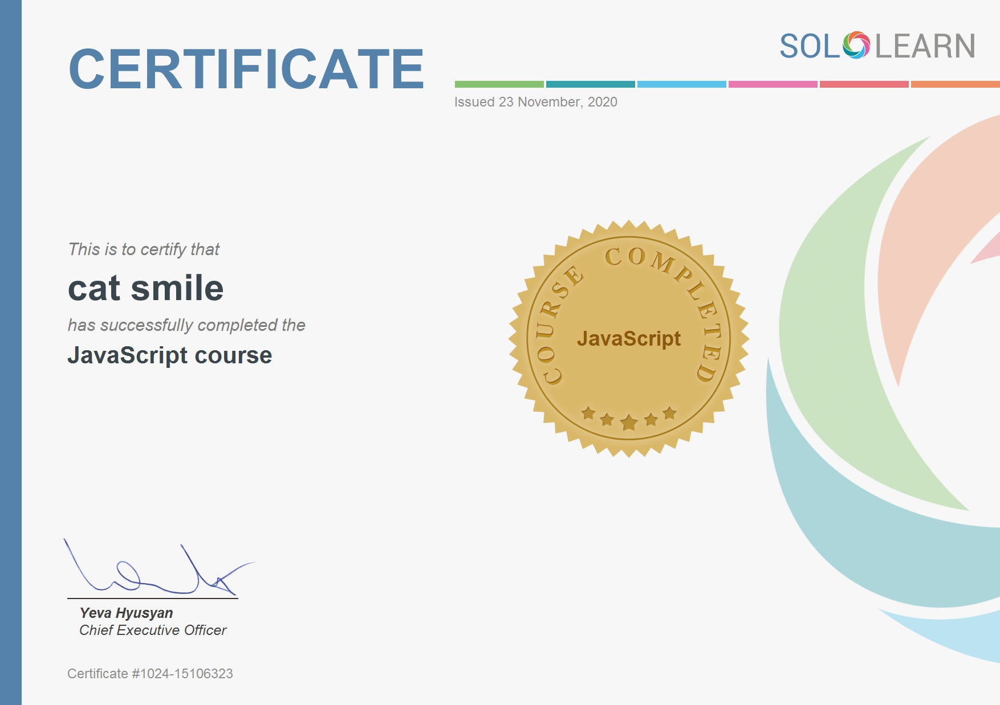

# Nodejs-Practice

## Environment
WSL, VSCode installation
 > https://docs.microsoft.com/en-us/windows/wsl/install-win10  
 > https://code.visualstudio.com/docs/remote/wsl  
 > https://code.visualstudio.com/docs/remote/wsl-tutorial  
 
Nodejs installation 
 > https://www.geeksforgeeks.org/installation-of-node-js-on-linux/  
 
Terminal installation  
> https://www.microsoft.com/en-us/p/windows-terminal/9n0dx20hk701?activetab=pivot:overviewtab  

## Development
1) Launch development env - Launch Terminal > "wsl" > "cd {project directory}" > "code ."  
2) Launch server - VSCode Terminal > "npm start" 
3) Launch localhost - Browser > localhost:{portnumber}
4) Edit code // type "rs" or save {main}.js to restart localhost // refresh to reload css  

## EjsNews
<p float="left">
    
    
</p>

```
Description: Using Ejs and axios, get news using API including search functionality  
Modules: express, ejs, axios, body-parser  
API: https://newsapi.org/  
```

## SimpleNews
  

```
Description: Using express, get news using newsapi library  
Modules: express, newsapi  
API: https://newsapi.org/  
```


# Courses & References
 

```
SoloLearn is an online and mobile learning platform that allows users to learn a variety of programming languages and concepts through short lessons, code challenges, and quizzes.
```
