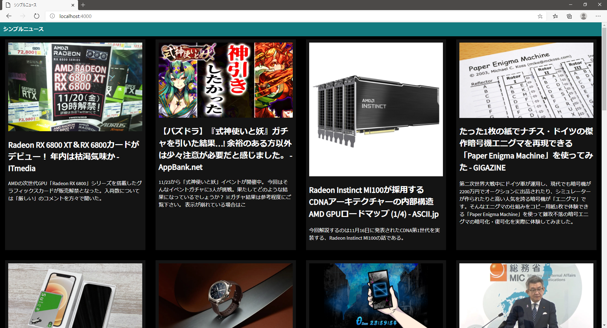

# Nodejs-Practice

## EjsNews

    
    

Description: Using Ejs and axios, get news using API including search functionality  
Modules: express, ejs, axios, body-parser  
API: https://newsapi.org/  
  
## SimpleNews
  
Description: Using express , get news using newsapi library  
Modules: express, newsapi  
API: https://newsapi.org/  
